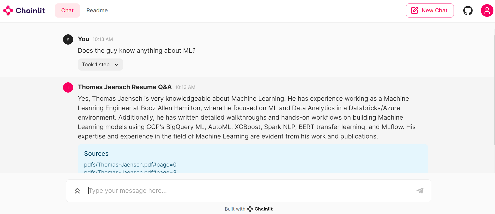

# Thomas Jaensch Resume Chat! 🚀🤖*

This is an interactive resume app built with [OpenAI](https://openai.com/) (GPT3.5 Large Language Model), [LangChain](https://www.langchain.com/) (LLM plumbing code), [Chroma](https://www.trychroma.com/) (vector store), and [Chainlit](https://docs.chainlit.io/get-started/overview) (UI). The app is deployed with [Docker](https://www.docker.com/) on [Google Cloud Platform](https://cloud.google.com/).

## Live Link on Google Cloud Platform
Deprecated, I made another, better resume app: https://tjaensch-genai-resume-matching-acbecxvgna-uc.a.run.app/

## Chroma Q&A with Sources Element

This repository contains a Chainlit application that provides a question-answering service using documents stored in a Chroma vector store. It allows users to upload PDF documents, which are then chunked, embedded, and indexed for efficient retrieval. When a user asks a question, the application retrieves relevant document chunks and uses OpenAI's language model to generate an answer, citing the sources it used.

## High-Level Description

The `app.py` script performs the following functions:

1. **PDF Processing (`process_pdfs`)**: Chunks PDF files into smaller text segments, creates embeddings for each chunk, and stores them in Chroma.
2. **Document Indexing (`index`)**: Uses `SQLRecordManager` to track document writes into the vector store.
3. **Question Answering (`on_message`)**: When a user asks a question, the application retrieves relevant document chunks and generates an answer using OpenAI's language model, providing the sources for transparency.

## Code Definitions

- `process_pdfs`: Function that processes PDF files and indexes them into Chroma.
- `on_chat_start`: Event handler that sets up the Chainlit session with the necessary components for question answering.
- `on_message`: Event handler that processes user messages, retrieves relevant information, and sends back an answer.
- `PostMessageHandler`: Callback handler that posts the sources of the retrieved documents as a Chainlit element.

--------------
\* Template code from the Chainlit cookbook repo https://github.com/Chainlit/cookbook/tree/main/chroma-qa-chat 

